---
## Front matter
title: "Отчёт по лабораторной работе №3"
author: "Ярослав Антонович Меркулов"

## Generic otions
lang: ru-RU
toc-title: "Содержание"

## Bibliography
bibliography: bib/cite.bib
csl: pandoc/csl/gost-r-7-0-5-2008-numeric.csl

## Pdf output format
toc: true # Table of contents
toc-depth: 2
lof: true # List of figures
fontsize: 12pt
linestretch: 1.5
papersize: a4
documentclass: scrreprt
## I18n polyglossia
polyglossia-lang:
  name: russian
  options:
	- spelling=modern
	- babelshorthands=true
polyglossia-otherlangs:
  name: english
## I18n babel
babel-lang: russian
babel-otherlangs: english
## Fonts
mainfont: IBM Plex Serif
romanfont: IBM Plex Serif
sansfont: IBM Plex Sans
monofont: IBM Plex Mono
mathfont: STIX Two Math
mainfontoptions: Ligatures=Common,Ligatures=TeX,Scale=0.94
romanfontoptions: Ligatures=Common,Ligatures=TeX,Scale=0.94
sansfontoptions: Ligatures=Common,Ligatures=TeX,Scale=MatchLowercase,Scale=0.94
monofontoptions: Scale=MatchLowercase,Scale=0.94,FakeStretch=0.9
mathfontoptions:
## Biblatex
biblatex: true
biblio-style: "gost-numeric"
biblatexoptions:
  - parentracker=true
  - backend=biber
  - hyperref=auto
  - language=auto
  - autolang=other*
  - citestyle=gost-numeric
## Pandoc-crossref LaTeX customization
figureTitle: "Рис."
tableTitle: "Таблица"
listingTitle: "Листинг"
lofTitle: "Список иллюстраций"
lolTitle: "Листинги"
## Misc options
indent: true
header-includes:
  - \usepackage{indentfirst}
  - \usepackage{float} # keep figures where there are in the text
  - \floatplacement{figure}{H} # keep figures where there are in the text
---

# Цель работы

Получить и закрепить практические навыки по работе со средствами контроля 
версий на примере git, а также изучить идеологию и применение.

# Выполнение лабораторной работы

1.  Создаём учётную запись на github.

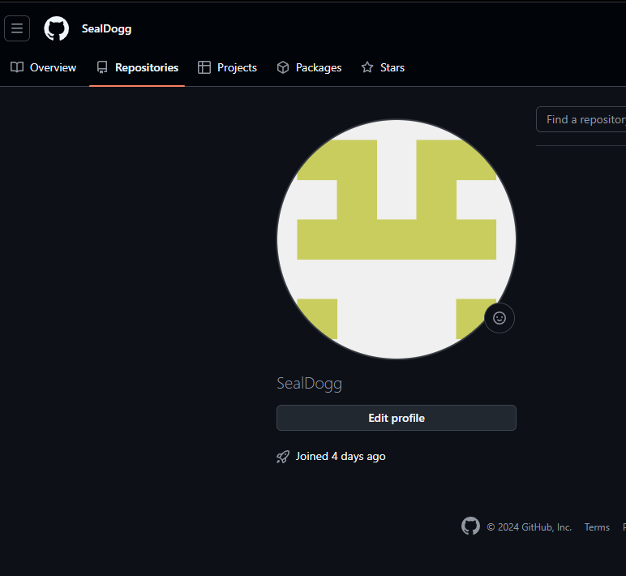

2.  Задаём имя пользователя и электронную почту для git.

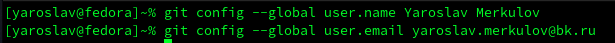

3.  Задаём оставшиеся параметры.

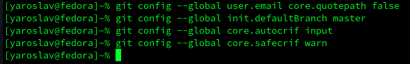

4.  Создаём SSH ключ.

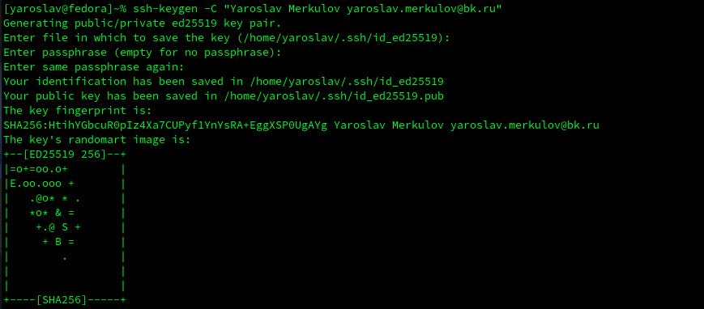

5.  Копируем созданный ключ.

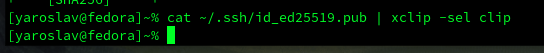

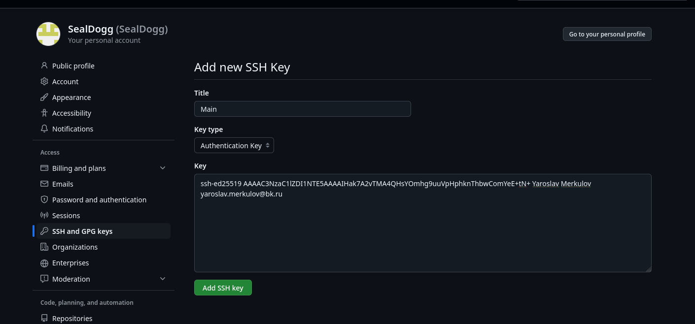

6.  Создаём каталог для предмета «Архитектура компьютера».

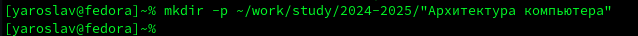

7.  Создаём репозиторий на основе шаблона.

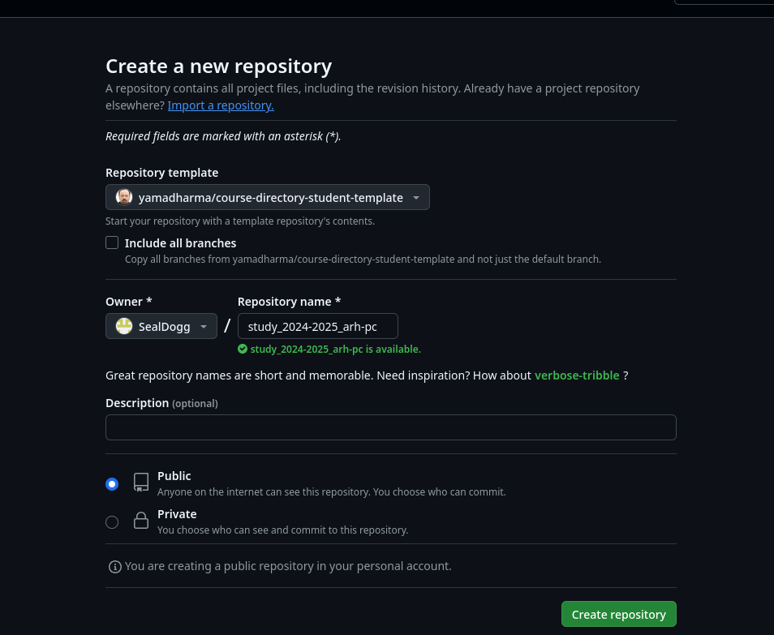

8.  Переходим в каталог курса.

9.  Клонируем созданный репозиторий в каталог.

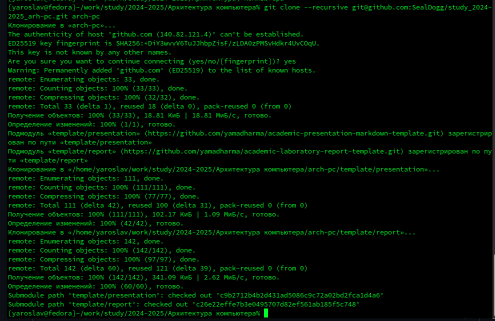

10. Переходим в каталог курса и удаляем лишние файлы.

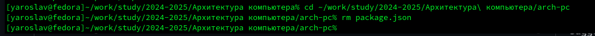

11. Создаём необходимые каталоги.

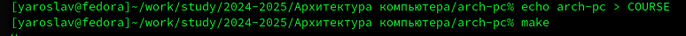

12. Отправляем файлы на сервер.

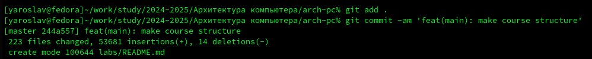

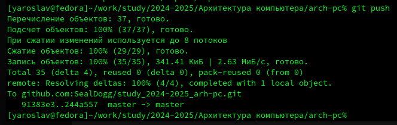

13. Проверяем правильность создания иерархии.

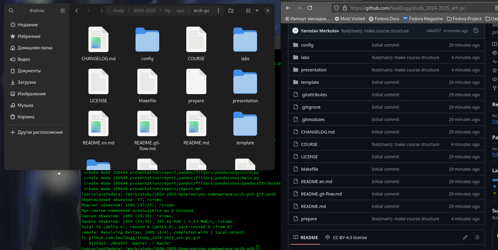

# Выполнение задания для самостоятельной работы

1.  Копируем отчёты по первой и второй лабораторной работе.

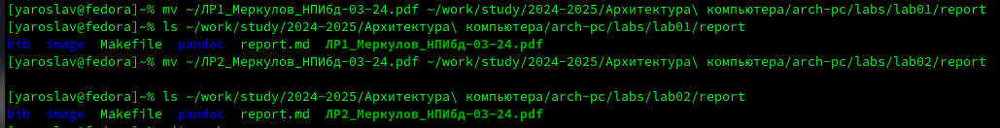

2.  Подгружаем в репозиторий.

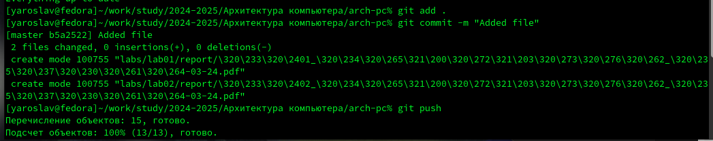

# Выводы

Мы научились пользоваться средствами контроля версий (git), 
отработали команды, создали собственный репозиторий на GitHub для хранения 
отчётов по лабораторным работам.

