---
## Front matter
title: "Отчёт по лабораторной работе №4"
author: "Ярослав Антонович Меркулов"

## Generic otions
lang: ru-RU
toc-title: "Содержание"

## Bibliography
bibliography: bib/cite.bib
csl: pandoc/csl/gost-r-7-0-5-2008-numeric.csl

## Pdf output format
toc: true # Table of contents
toc-depth: 2
lof: true # List of figures
fontsize: 12pt
linestretch: 1.5
papersize: a4
documentclass: scrreprt
## I18n polyglossia
polyglossia-lang:
  name: russian
  options:
	- spelling=modern
	- babelshorthands=true
polyglossia-otherlangs:
  name: english
## I18n babel
babel-lang: russian
babel-otherlangs: english
## Fonts
mainfont: IBM Plex Serif
romanfont: IBM Plex Serif
sansfont: IBM Plex Sans
monofont: IBM Plex Mono
mathfont: STIX Two Math
mainfontoptions: Ligatures=Common,Ligatures=TeX,Scale=0.94
romanfontoptions: Ligatures=Common,Ligatures=TeX,Scale=0.94
sansfontoptions: Ligatures=Common,Ligatures=TeX,Scale=MatchLowercase,Scale=0.94
monofontoptions: Scale=MatchLowercase,Scale=0.94,FakeStretch=0.9
mathfontoptions:
## Biblatex
biblatex: true
biblio-style: "gost-numeric"
biblatexoptions:
  - parentracker=true
  - backend=biber
  - hyperref=auto
  - language=auto
  - autolang=other*
  - citestyle=gost-numeric
## Pandoc-crossref LaTeX customization
figureTitle: "Рис."
tableTitle: "Таблица"
listingTitle: "Листинг"
lofTitle: "Список иллюстраций"
lolTitle: "Листинги"
## Misc options
indent: true
header-includes:
  - \usepackage{indentfirst}
  - \usepackage{float} # keep figures where there are in the text
  - \floatplacement{figure}{H} # keep figures where there are in the text
---

# Цель работы

Научится компилировать и собирать программы, написанные на ассемблере NASM

# Выполнение лабораторной работы

1.	Создаём каталог для работы с программами на языке ассемблера NASM.

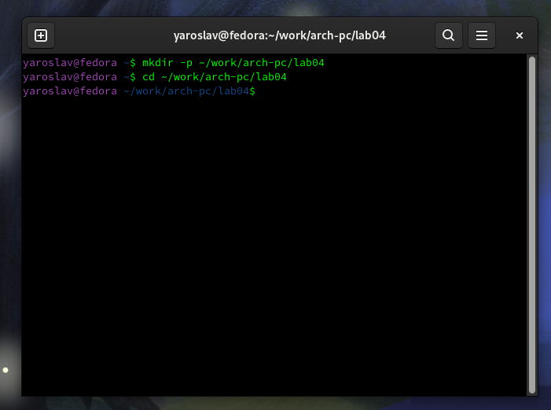

2. 	Создаём текстовый файл с именем *hello.asm*.

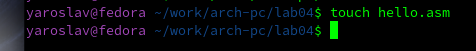

3.  Открываем созданный файл с помощью *gedit*.

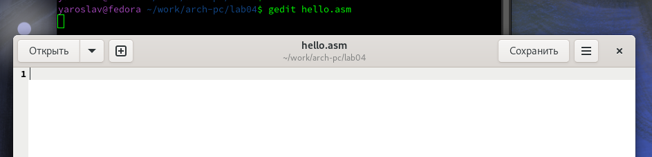

4.  Вводим заданный текст.

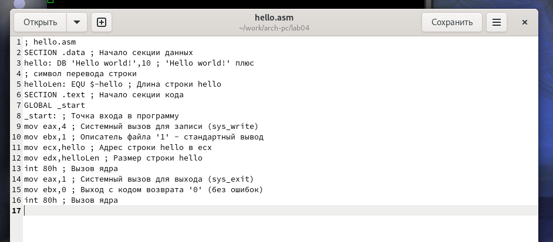

5.  Выполняем трансляцию с помощью *nasm*.

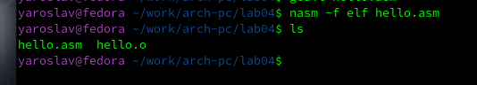

6.  Снова выполняем трансляцию, но с другими параметрами.

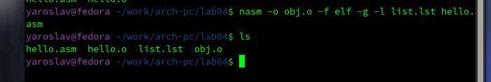

7.  Переходим к компоновке. Используем *ld*.

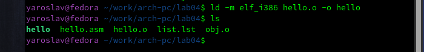

8.  Используем компоновку с другими параметрами. Получаем исполняемый файл с другим названием.

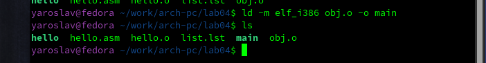

9.  Запускаем файл.

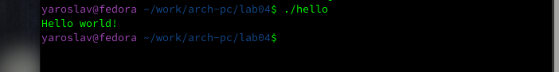

# Выполнение самостоятельной работы

1.  Копируем *hello.asm* и переименовываем в *lab04.asm*.

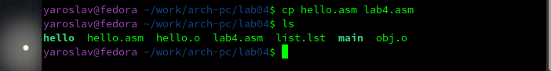

2.  Открываем с помощью *gedit* файл *lab04.asm*. Меняем *Hello world!* на *Меркулов Ярослав*.

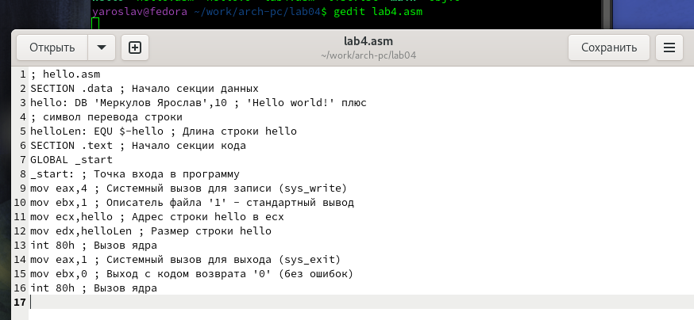

3.  Оттранслируем и скомпонуем файл.

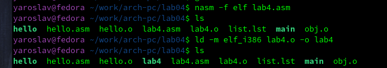

4.  Запускаем получившийся файл.

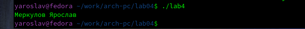

5.  Копируем текстовые файлы в локальный репозиторий.

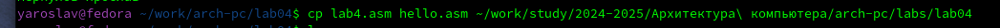

6.  Проверяем наличие файлов.

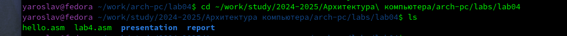

7.  Загружаем всё на *Github*.

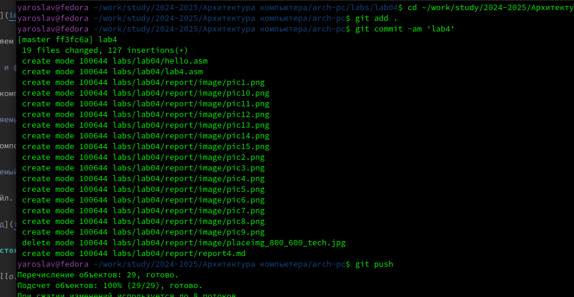

# Выводы

Были получены знания и умения по работе с NASM (компиляции и сборки).

