---
## Front matter
title: "Отчёт по лабораторной работе №5"
author: "Ярослав Антонович Меркулов"

## Generic otions
lang: ru-RU
toc-title: "Содержание"

## Bibliography
bibliography: bib/cite.bib
csl: pandoc/csl/gost-r-7-0-5-2008-numeric.csl

## Pdf output format
toc: true # Table of contents
toc-depth: 2
lof: true # List of figures
fontsize: 12pt
linestretch: 1.5
papersize: a4
documentclass: scrreprt
## I18n polyglossia
polyglossia-lang:
  name: russian
  options:
	- spelling=modern
	- babelshorthands=true
polyglossia-otherlangs:
  name: english
## I18n babel
babel-lang: russian
babel-otherlangs: english
## Fonts
mainfont: IBM Plex Serif
romanfont: IBM Plex Serif
sansfont: IBM Plex Sans
monofont: IBM Plex Mono
mathfont: STIX Two Math
mainfontoptions: Ligatures=Common,Ligatures=TeX,Scale=0.94
romanfontoptions: Ligatures=Common,Ligatures=TeX,Scale=0.94
sansfontoptions: Ligatures=Common,Ligatures=TeX,Scale=MatchLowercase,Scale=0.94
monofontoptions: Scale=MatchLowercase,Scale=0.94,FakeStretch=0.9
mathfontoptions:
## Biblatex
biblatex: true
biblio-style: "gost-numeric"
biblatexoptions:
  - parentracker=true
  - backend=biber
  - hyperref=auto
  - language=auto
  - autolang=other*
  - citestyle=gost-numeric
## Pandoc-crossref LaTeX customization
figureTitle: "Рис."
tableTitle: "Таблица"
listingTitle: "Листинг"
lofTitle: "Список иллюстраций"
lolTitle: "Листинги"
## Misc options
indent: true
header-includes:
  - \usepackage{indentfirst}
  - \usepackage{float} # keep figures where there are in the text
  - \floatplacement{figure}{H} # keep figures where there are in the text
---

# Цель работы

Приобрести практические навыки по работе с Midnight Commander, а также освоить инструкции mov и int

# Выполнение лабораторной работы

1.	Открываем Midnight Commander.

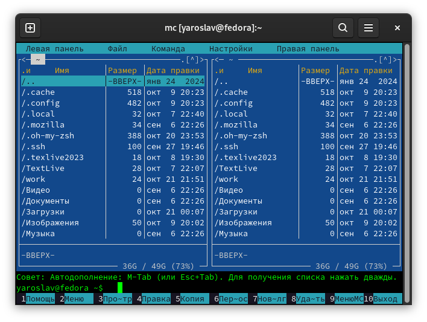

2. 	Переходим в каталог ~/work/arch-pc.

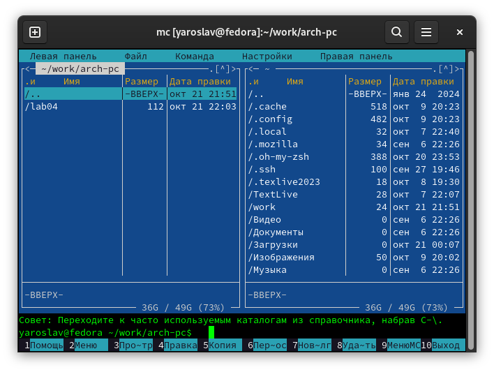

3.  Создаём каталог lab05.

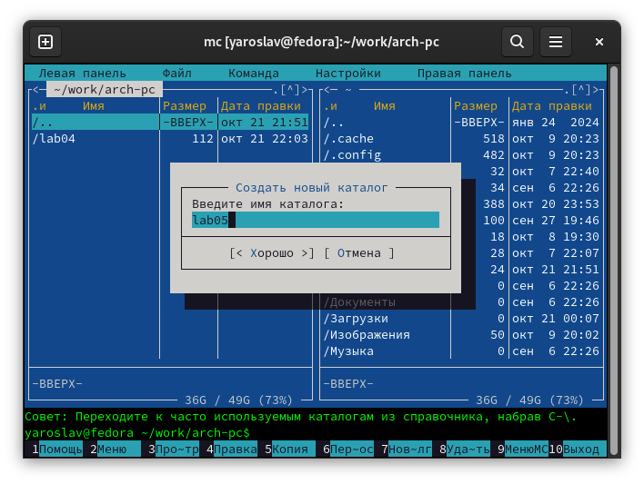

4.  Создаём файл lab5-1.asm.

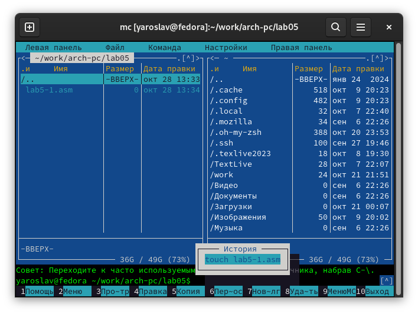

5.  Открываем lab5-1.asm с помощью встроенного редактора.

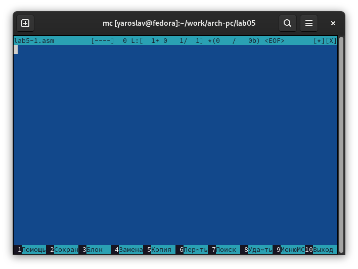

6.  Вводим текст программы.

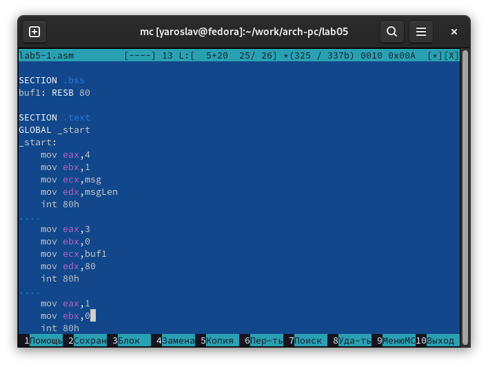

7.  Просматриваем ещё раз файл.

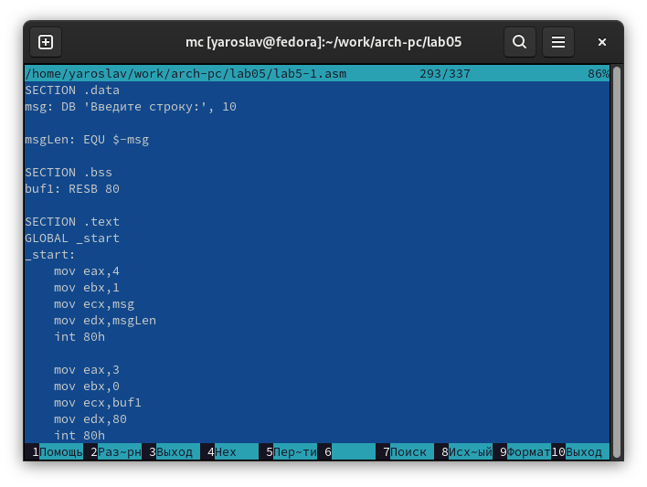

8.  Транслируем и компонуем объектный файл, запускаем и вводим ФИО.

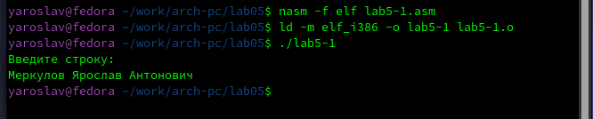

9.  Скачиваем файл in_out.asm и копируем его в наш каталог.

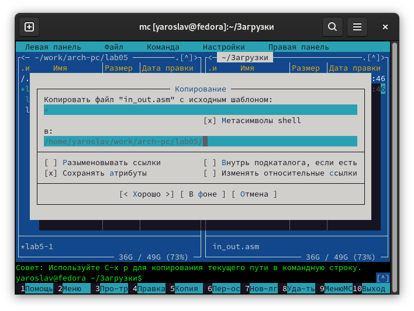

10. Создаём копию файла lab5-1.asm.

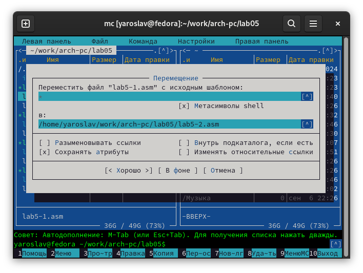

11. Вводим текст в lab5-2.asm.

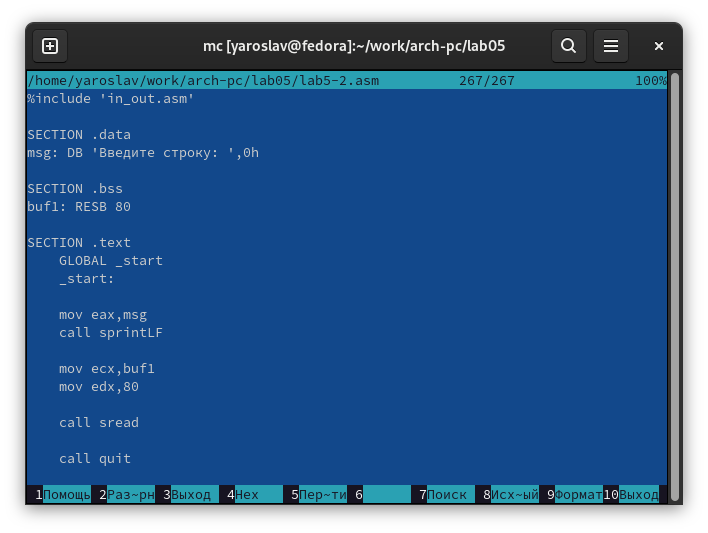

12. Транслируем, компонуем, запускаем lab5-2.asm.

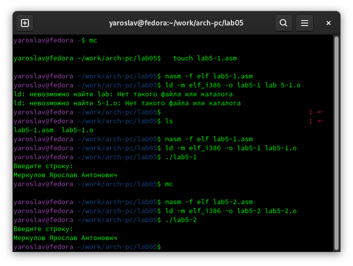

13. Меняем sprintLF на sprint и смотрим на результат.

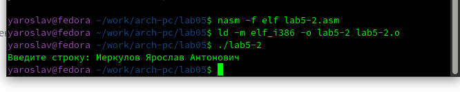

# Выполнение самостоятельной работы

1.  Копируем lab5-1.asm с новым названием lab5-3.asm.

2.  Изменяем программу под заданные условия и тестируем.

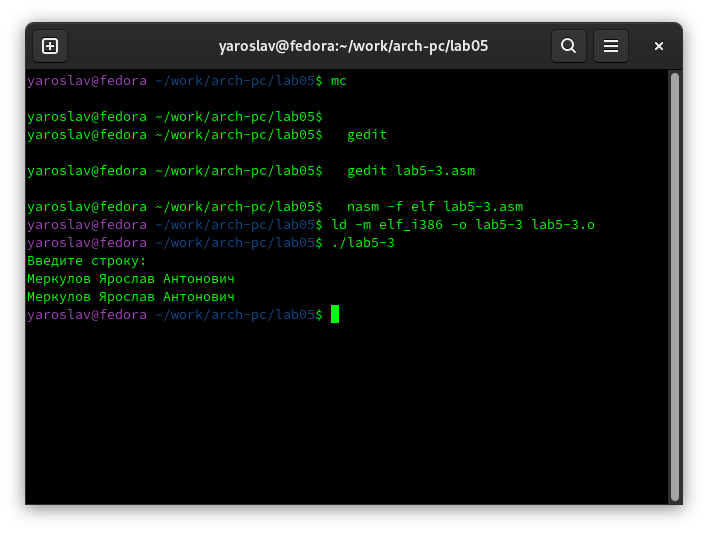

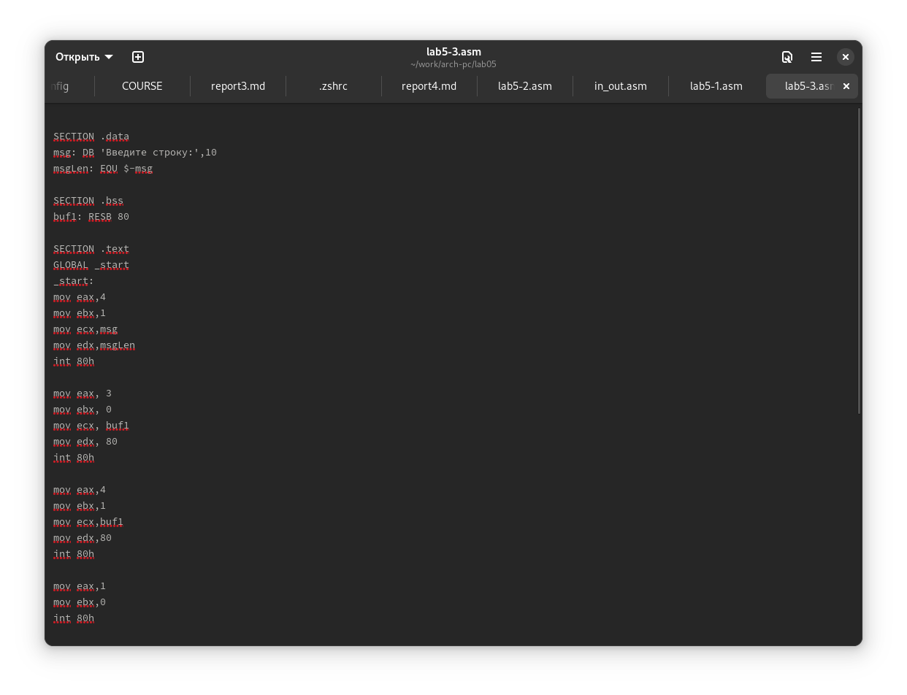

3.  Копируем lab5-2.asm с новым названием lab5-4.asm.

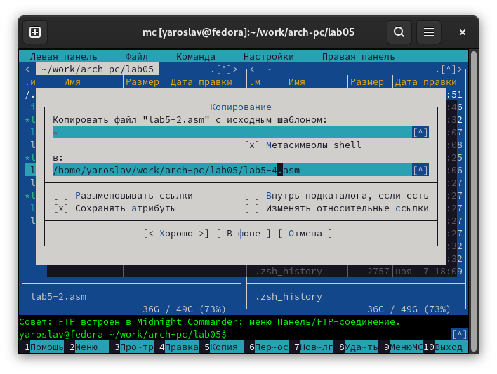

4.  Тестируем.

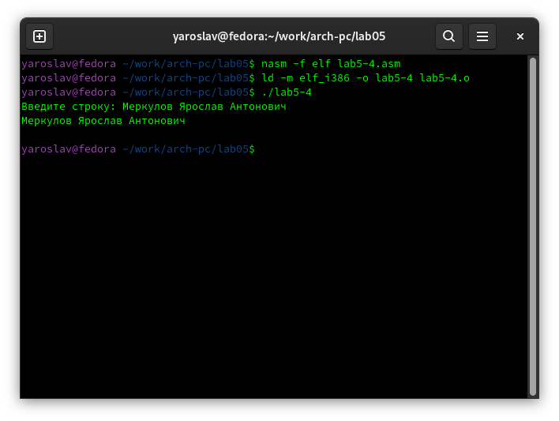

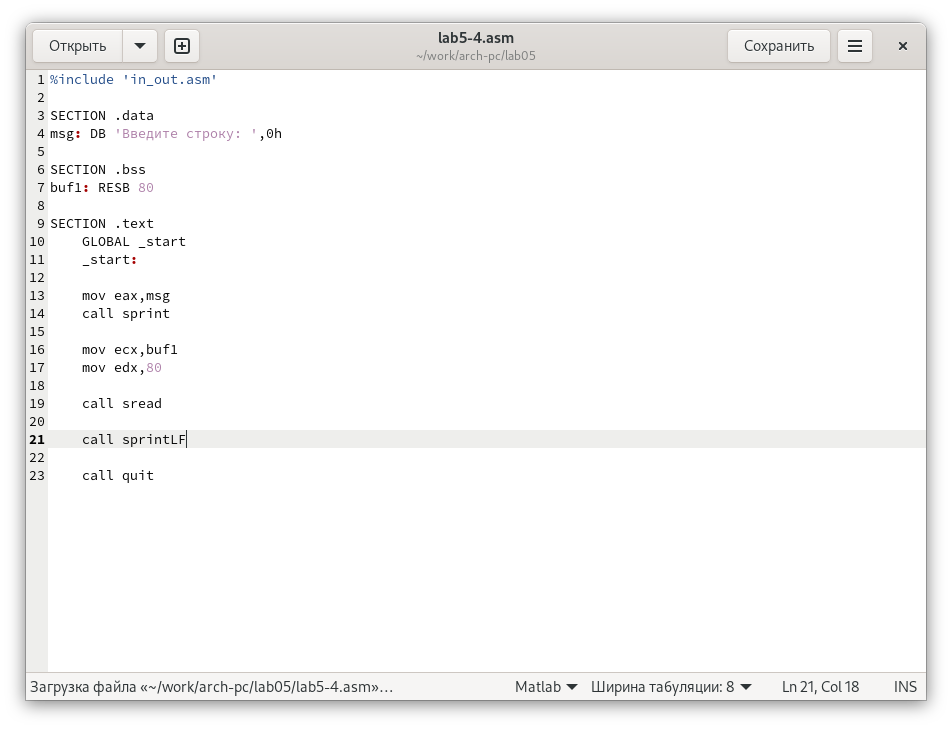

# Выводы

Был освоен mc, а также были отработаны инструкции ассемблера mov и int.

