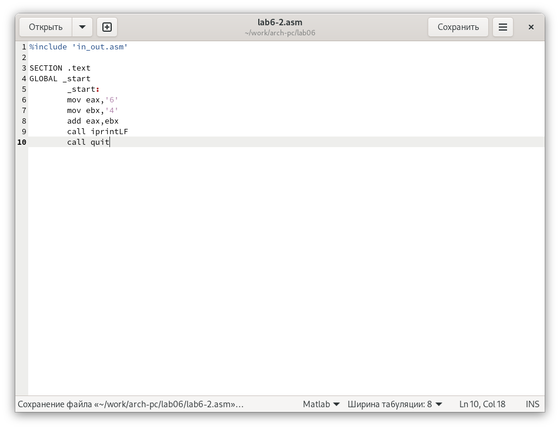

---
## Front matter
title: "Отчёт по лабораторной работе №6"
author: "Ярослав Антонович Меркулов"

## Generic otions
lang: ru-RU
toc-title: "Содержание"

## Bibliography
bibliography: bib/cite.bib
csl: pandoc/csl/gost-r-7-0-5-2008-numeric.csl

## Pdf output format
toc: true # Table of contents
toc-depth: 2
lof: true # List of figures
fontsize: 12pt
linestretch: 1.5
papersize: a4
documentclass: scrreprt
## I18n polyglossia
polyglossia-lang:
  name: russian
  options:
	- spelling=modern
	- babelshorthands=true
polyglossia-otherlangs:
  name: english
## I18n babel
babel-lang: russian
babel-otherlangs: english
## Fonts
mainfont: IBM Plex Serif
romanfont: IBM Plex Serif
sansfont: IBM Plex Sans
monofont: IBM Plex Mono
mathfont: STIX Two Math
mainfontoptions: Ligatures=Common,Ligatures=TeX,Scale=0.94
romanfontoptions: Ligatures=Common,Ligatures=TeX,Scale=0.94
sansfontoptions: Ligatures=Common,Ligatures=TeX,Scale=MatchLowercase,Scale=0.94
monofontoptions: Scale=MatchLowercase,Scale=0.94,FakeStretch=0.9
mathfontoptions:
## Biblatex
biblatex: true
biblio-style: "gost-numeric"
biblatexoptions:
  - parentracker=true
  - backend=biber
  - hyperref=auto
  - language=auto
  - autolang=other*
  - citestyle=gost-numeric
## Pandoc-crossref LaTeX customization
figureTitle: "Рис."
tableTitle: "Таблица"
listingTitle: "Листинг"
lofTitle: "Список иллюстраций"
lolTitle: "Листинги"
## Misc options
indent: true
header-includes:
  - \usepackage{indentfirst}
  - \usepackage{float} # keep figures where there are in the text
  - \floatplacement{figure}{H} # keep figures where there are in the text
---

# Цель работы

Освоить арифметические инструкции языка программирования NASM 

# Выполнение лабораторной работы

## Символьные и численные данные в NASM

1.  Создаём каталог для лабораторной работы, переходим в него и создаём файл lab6-1.asm.

{width=70%}

2.  Вводим текст программы из листинга 6.1.

{width=70%}

3.  Создаём исполняемый файл и запускаем. В результате выводится символ j.

{width=70%}

4. Изменяем текст программы (убираем одинарные кавычки), создаём исполняемый файл и запускаем. Вывелся символ переноса строки.

{width=70%}

{width=70%}

5.  Создаём новый файл и переносим туда текст из листинга 6.2.

{width=70%}

6.  Создаём исполняемый файл и запускаем. Видим число 106.

{width=70%}

7.  Удаляем одинарные кавычки (как в пункте 4).

{width=70%}

{width=70%}

8.  Меняем iprintLF на iprint. Вывод сработал без переноса на следующую строку.

{width=70%}

{width=70%}

## Выполнение арифметических операций в NASM

9.  Создаём lab6-3.asm.

{width=70%}

10. Копируем листинг в созданный файл.

{width=70%}

11. Запускаем, получаем результат.

{width=70%}

12. Меняем текст программы под новые условия. Запускаем.

{width=70%}

{width=70%}

13. Создаём файл variant.asm и вставляем туда листинг 6.4. Запускаем и вводим номер студ.билета. Получаем номер варианта.

{width=70%}

{width=70%}

## Ответы на вопросы

1.  Строки mov eax,rem и call sprint отвечают за вывод на экран сообщения ‘Ваш вариант:’.
2.  mov ecx, x      ; запись в eax значения х
    mov edx, 80     ; запись в edx значения 80
    call sread      ; вызов функции чтения
3.  Вызов функции atoi - функции преобразования ascii-кода символа в целое число.
4.  Строки xor edx,edx mov ebx,20 div ebx inc edx отвечают за вычисления варианта.
5.  Остаток от деления при выполнении инструкции “div ebx” записывается в edx.
6.  inc edx увеличивает значение в edx на 1 и перезаписывает его в edx.
7.  Строки mov eax,edx call iprintLF отвечают за вывод результата.

# Выполнение самостоятельной работы

1.  Создаём файл fx.asm и пишем в нём текст программы (14 вариант).

{width=70%}

2.  Проверяем работу на заданных числах.

{width=70%}

# Выводы

Были освоены арифметические операции в NASM

