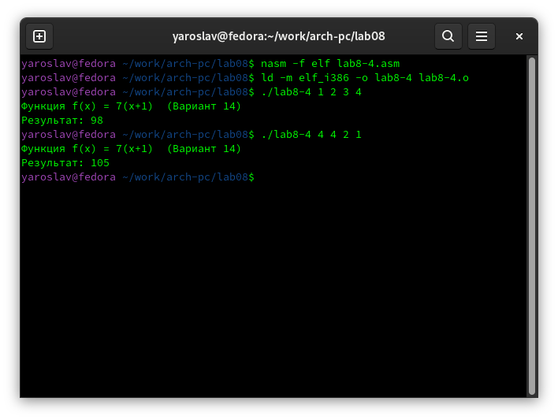

---
## Front matter
title: "Отчёт по лабораторной работе №8"
author: "Ярослав Антонович Меркулов"

## Generic otions
lang: ru-RU
toc-title: "Содержание"

## Bibliography
bibliography: bib/cite.bib
csl: pandoc/csl/gost-r-7-0-5-2008-numeric.csl

## Pdf output format
toc: true # Table of contents
toc-depth: 2
lof: true # List of figures
fontsize: 12pt
linestretch: 1.5
papersize: a4
documentclass: scrreprt
## I18n polyglossia
polyglossia-lang:
  name: russian
  options:
	- spelling=modern
	- babelshorthands=true
polyglossia-otherlangs:
  name: english
## I18n babel
babel-lang: russian
babel-otherlangs: english
## Fonts
mainfont: IBM Plex Serif
romanfont: IBM Plex Serif
sansfont: IBM Plex Sans
monofont: IBM Plex Mono
mathfont: STIX Two Math
mainfontoptions: Ligatures=Common,Ligatures=TeX,Scale=0.94
romanfontoptions: Ligatures=Common,Ligatures=TeX,Scale=0.94
sansfontoptions: Ligatures=Common,Ligatures=TeX,Scale=MatchLowercase,Scale=0.94
monofontoptions: Scale=MatchLowercase,Scale=0.94,FakeStretch=0.9
mathfontoptions:
## Biblatex
biblatex: true
biblio-style: "gost-numeric"
biblatexoptions:
  - parentracker=true
  - backend=biber
  - hyperref=auto
  - language=auto
  - autolang=other*
  - citestyle=gost-numeric
## Pandoc-crossref LaTeX customization
figureTitle: "Рис."
tableTitle: "Таблица"
listingTitle: "Листинг"
lofTitle: "Список иллюстраций"
lolTitle: "Листинги"
## Misc options
indent: true
header-includes:
  - \usepackage{indentfirst}
  - \usepackage{float} # keep figures where there are in the text
  - \floatplacement{figure}{H} # keep figures where there are in the text
---

# Цель работы

Приобрести навыки написания программ с использованием циклов и обработкой аргументов командной строки.

# Выполнение лабораторной работы

## Реализация циклов в NASM

1.  Создаём каталог для лабораторной работы, переходим в него и создаём файл lab8-1.asm.

{width=70%}

2.  Вводим текст программы из листинга 8.1.

{width=70%}

3.  Создаём исполняемый файл и запускаем.

{width=70%}

4. Изменяем текст программы, создаём исполняемый файл и запускаем. Программа перескакивает через число (некорректная работа).

{width=70%}

{width=70%}

5.  Меняем программу так, чтоб использовался стек.

{width=70%}

6.  Создаём исполняемый файл и запускаем.

{width=70%}

## Обработка аргументов командной строки

7.  Создаём файл lab8-2.asm и записываем туда листинг 8-2.

{width=70%}

8. Запускаем программу. Видим, что вывелось 4 аргумента ("аргумент 2" был считан как два аргумента).

{width=70%}

9. Создаём файл lab8-3.asm и записываем туда листинг 8-3.

{width=70%}

10. Проверяем работу.

{width=70%}

11. Меняем программу для вычисления произведения.

{width=70%}

12. Проверяем работу.

{width=70%}

# Выполнение самостоятельной работы

1.  Создаём файл lab8-4.asm и пишем в нём текст программы (14 вариант).

{width=70%}

2.  Проверяем работу.

{width=70%}

# Выводы

Были изучены циклы, были отработаны программы с использованием аргументов.

